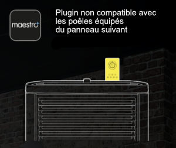
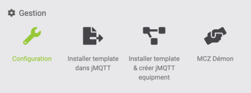
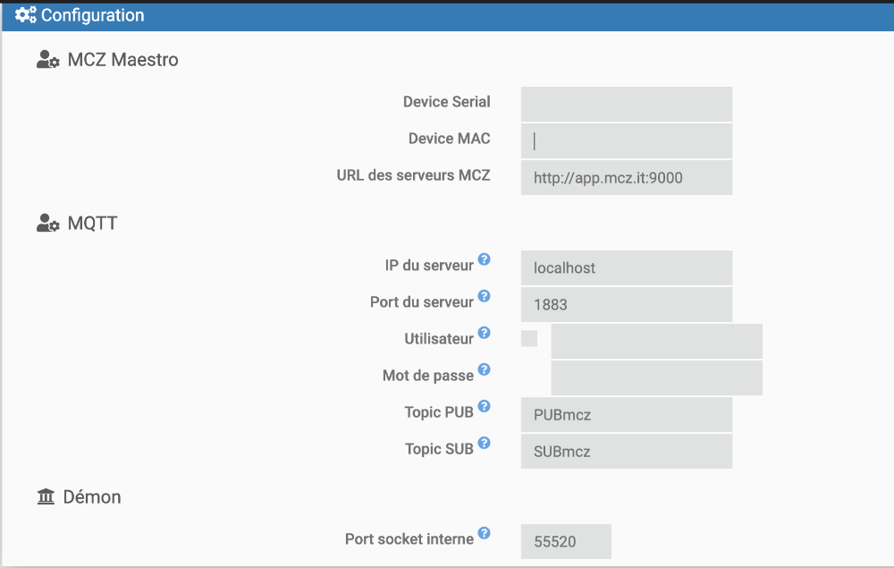
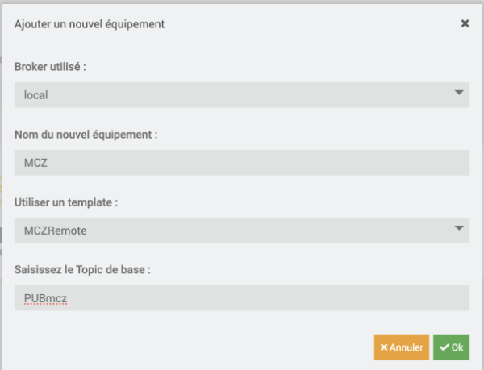
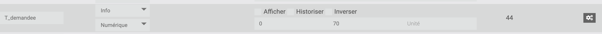
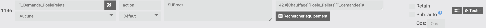

# Plugin mczremote

Ce plugin permet de dialoguer avec un poêle à pellets de la gamme MCZ Maestro via les serveurs de MCZ. Certains poêles de la marque Brisach sont également supportés.

Les informations et actions sont présentées ou transmises via MQTT.

Ce plugin est prévu pour être installé sur le serveur Jeedom.

Cette version supporte l'environnement python venv pour fonctionner avec Jeedom 4.4 et Debian Bookworm

> **Prérequis**
>
>Votre poêle doit être connecté au wifi de votre domicile. Il doit pouvoir être contrôlé par l'application MCZ Maestro ou Brisach+ à partir de votre smartphone en 4G ou hors de votre domicile.
>
>> ***Attention***
>>
>> Ce plugin n'est pas compatible avec les poêles qui utilisent l'application Maestro MCZ ou Maestro+ et le protocole Maestro+.
>>
>> Seuls les poêles Brisach qui utilisent l'application Brisach+ sont compatibles avec ce plugin
>>
>>
>> 
>>

> **MQTT**
>
> Vous devez disposer ou avoir préalablement installé un plugin MQTT connecté à un serveur MQTT. Généralement mosquitto.  
> L'ensemble peut être installé via le plugin ***jMQTT***.
> 

# GESTION

Dans cette page, vous avez les boutons suivants:

- Configuration: Donne l'accès à la configuration du plugin

- Télécharger le template:  Le template MCZRemote.json est téléchargé sur votre ordinateur.

- MCZ Démon: Permet de tester si le démon MCZ est toujours actif.

# CONFIGURATION

## La configuration en quelques clics

Dans cette page de configuration, outre les informations habituelles pour un équipement, vous avez la zone de configuration pour indiquer les paramètres de fonctionnement et de connexion.

### MCZ Maestro

Cette zone permet l'introduction des informations pour votre poêle.

- Device serial:  Vous devez indiquer dans cette zone l'information *Device serial* de votre poêle

- Device MAC:   Vous devez indiquer dans cette zone l'information *Device MAC* de votre poêle

- URL des serveurs MCZ:   Cette information est préremplie avec l'URL des serveurs MCZ.

### MQTT

- IP du serveur:  Vous devez spécifier ici l'adresse IP du serveur MQTT.  Ce serveur peut être local sur votre Jeedom. L'adresse IP est alors 127.0.0.1

- Port du serveur:  Généralement, le port est 1883 sauf si la configuration du serveur MQTT a été modifiée.

- Utilisateur et Mot de passe:  Ces informations sont optionnelles. Il faut les indiquer si votre serveur MQTT nécessite un utilisateur et mot de passe pour se connecter.

- Topic PUB:   Cette information est préremplie avec le topic de publication sur le serveur MQTT. Ne pas la changer si vous utilisez le template.

- Topic SUB:   Cette information est préremplie avec le topic de publication sur le serveur MQTT. Ne pas la changer si vous utilisez le template

### Démon

- Port socket interne  C'est le port de dialogue entre le démon et Jeedom. Ce port doit être adapté si vous avez un conflit de port sur votre installation.

## Installation des dépendances

Cette opération va installer sur votre Jeedom les modules python nécessaires au fonctionnement du démon.

## Démon

Dans cette zone, vous pouvez agir sur le démon.

Un message éventuel dans cette zone indique un problème à corriger.

# Création de votre poêle

Un template pour la création de votre poêle est disponible dans le plugin ***jMQTT***.

Le template est visible dans jMQTT comme *MCZRemote*. Celui-ci permet de créer facilement les commandes infos et actions dans jMQTT pour la gestion du poêle.

Dans jMQTT, utilisez le bouton + pour ajouter un équipement.

Spécifiez le broker à utiliser.  
Donnez un nom à votre équipement. 
Sélectionnez le template *MCZRemote*.
Indiquez comme topic de base *PUBmcz*.  Respectez les majuscules et minuscules.

Les commandes sont crées. Il vous reste à terminer la configuration de base de votre équipement et à le sauvegarder.

> Commande action: Temp_demandee_T1  et CmdPoele
>
> Ces deux commandes doivent être finalisée pour transmettre une valeur vers jMQTT et le poêle.  
> La valeur CMD doit être remplacée par une commande info d'un virtuel.  
> Temp_demandee_T1 permet d'envoyer la température de consigne au poêle.  
> CmdPoele permet elle d'envoyer n'importe quelle chaîne de caractères vers le poêle. Cette chaîne (xx,yyy) doit être composée de la commande (xx) et de sa valeur (yyy)
>
>> Exemple:
>> J’ai un équipement thermostat [chauffage][Poele_Pellets] qui permet d’envoyer la consigne de température.
>> Dans cet équipement, j’ai un slider dont le résultat est disponible via une commande info
>> 
>>
>> Le nom complet de cette commande est #[Chauffage][Poele_Pellets][T_demandee]#
>>
>> Dans l’équipement PUBmcz, j’ai une commande action *T_Demandee_PoelePellets* pour envoyer la demande au poele.
>> Dans la partie valeur, j’ai remplacé le CMD de « 42,CMD » par la commande donnée plus haut: #[Chauffage][Poele_Pellets][T_demandee]#
>>
>> 
>>
>> Si vous avez plusieurs sources de définition de température, il faut définir pour chacune d’elle une commande action dans l’équipement PUBmcz et effectuer une configuration du même genre.
>>

# COMMANDES ACTIONS DU POELE

Ce sont les commandes qu'il faut envoyer au poele pour le controler.
Cette liste n'est pas exhaustive. Il y a plus d'informations dans le forum à l'url :
https://community.jeedom.com/t/mcz-maestro-et-jeedom/6159/183

Allumer/Eteindre
  - Allumer:  34,1  
  - Éteindre: 34,40  

Passage Mode Eté/Hiver :
  - Eté     : 58,1
  - Hiver   : 58,0

Mode ACTIVE :
  - Activé      : 35,1
  - Désactivé   : 35,0
  - Reset du mode ACTIVE : 2,255 

Sons du poêle : 
  - Activé:     50,1
  - Desactiver: 50,0

Mode ECO 
  - Activer:    41,1
  - Désactiver: 41,0

Désactiver le thermostat interne (c’est par exemple jeedom qui régulera les on et off) : 40,0

Régulation de température sur sonde (sonde interne) : 40,1

Puissance
  - Niveau 1 : 36,1
  - Niveau 2 : 36,2
  - Niveau 3 : 36,3
  - Niveau 4 : 36,4
  - Niveau 5 : 36,5   (Power 110%)

ChronoThermostato
  - ON : 1111,1
  - OFF : 1111,0

Modifier température consigne mode Chrono :
  - T1 : 1108,xx ou xx est la consigne demandée (nombre entier compris entre 5 et 35)
  - T2 : 1109,xx
  - T3 : 1110,xx

Ventilateur ambiance
  - Niveau 1  : 37,1
  - Niveau 2  : 37,2
  - Niveau 3  : 37,3
  - Niveau 4  : 37,4
  - Niveau 5  : 37,5
  - Automatique : 37,6
    
Ventilateur canalisé 1
  - Niveau 1  : 38,1
  - Niveau 2  : 38,2
  - Niveau 3  : 38,3
  - Niveau 4  : 38,4
  - Niveau 5  : 38,5
  - Automatique : 38,6
    
Ventilateur canalisé 2
  - Niveau 1  : 39,1
  - Niveau 2  : 39,2
  - Niveau 3  : 39,3
  - Niveau 4  : 39,4    
  - Niveau 5  : 39,5
  - Automatique : 39,6

Profil
  - Manuel    : 149,0
  - Dynamic   : 149,1
  - Overnight : 149,2
  - Confort   : 149,3
  - Power     : 149.4
  - Manuel Adaptatif    : 149,10
  - Dynamic Adaptatif   : 149,11
  - Overnight Adaptatif : 149,12
  - Confort Adaptatif   : 149,13
  - Power Adaptatif     : 149.14

>  **Remarque**:
>  Les modes adaptatif sont reconnus comme "code inconnu".  (Tests en cours)
>

Consigne de température    
  42,xx  avec xx le double de la température pour supporter les demi degré  

Mise à jour de la date et heure du poêle. (nécessite ce plugin)  
  9001,DDMMYYYYHHmm  
  exemple:  9001,011120212010      pour 01/11/2021 20h10

# REMERCIEMENTS

Ce plugin est largement inspiré des travaux de Anthony, EtienneME et Pipolas sur le forum suivant: <https://community.jeedom.com/t/mcz-maestro-et-jeedom/6159/183> 

Git original: <https://github.com/Anthony-55/maestro>  

Ce plugin a été créé pour aider, je ne souhaite en aucun cas m'approprier le code du script python qui n'est pas le mien, et sans lequel ce plugin n'existerait pas.

